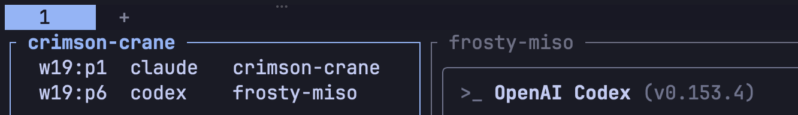

# herdr-agent-auto-naming

Readable two-word names for every agent Herdr detects, persisted as the pane label.

[](https://herdr.dev)
[](https://www.python.org/)
[](#install)

한국어 문서: [README.ko.md](README.ko.md)

A [Herdr](https://herdr.dev) plugin that names agents so you can talk to them.
`herdr agent prompt green-cow "rebase onto main"` is a command you can type from
memory; `herdr agent prompt w15:p8 "..."` is one you have to look up every time.

It hangs off Herdr's `pane.agent_detected` event rather than a per-runtime session
hook, so it names claude, codex, omp, agy, droid — anything Herdr classifies as an
agent — without installing anything into those agents. A session replaced in place by
`/clear` or `/new` is the case to know about; see
[`/clear` and `/new` take the name away](#clear-and-new-take-the-name-away).

The name is written to the **pane label**, not just the agent. An agent name dies
with the agent; the label outlives it. So when an agent reappears in a pane you
already know, it gets its old name back instead of a new one.

## Install

Requires Herdr 0.9.0+ and `python3` (standard library only) on macOS or Linux.

```sh
herdr plugin install azyu/herdr-agent-auto-naming
```

Or, to work on it locally:

```sh
herdr plugin link /path/to/herdr-agent-auto-naming
```

Naming starts at once — the event hook fires on the next agent Herdr detects, with
no server restart. Agents already running when you installed it keep their current
state until you sweep them:

```sh
herdr plugin action invoke azyu.agent-auto-naming.name-all
```

`herdr plugin list` shows the plugin, `herdr plugin disable azyu.agent-auto-naming`
turns it off, and `herdr plugin log list --plugin azyu.agent-auto-naming` shows
every name it has assigned.

## What your agents will be called



Names are `<left>-<right>` drawn from the union of two word lists: colors × animals
and adjectives × foods. 392 names, and a name in use is never offered twice. The
name titles the pane, so you can read it off the screen before you type it.

| Trigger | What it names |
| --- | --- |
| `pane.agent_detected` | The pane in the event — a new agent, or one that reappeared. |
| `pane.agent_status_changed` | The pane in the event, once an agent that lost its name works again. |
| Startup hook | Every agent with no name, when the Herdr server restores a session. |
| `name-all` action | Every agent with no name, on demand. |

## `/clear` and `/new` take the name away

Those commands do not restart the agent; they replace its session inside the same
process. Herdr treats a replaced session as a new agent and clears the name, so the
sidebar falls back to the bare runtime — `claude` — while the pane label survives.
Herdr reports no detection for it, which is what `pane.agent_status_changed` is
subscribed for: it is the first event that follows the replacement, and the label is
still there to rebind from. Measured on Herdr 0.9.1:

| Runtime | Name cleared | Recovered by |
| --- | --- | --- |
| codex `/new` | On the first prompt after it, when the new session is reported. | The plugin, on that same turn. |
| omp `/new` | Immediately. | The plugin, within a second. |
| Claude Code `/clear`, `/new` | Immediately. | The plugin, on the pane's next status change — in practice its next turn that uses a tool. |

Claude Code is the slow one because Herdr reads its status off the screen. A turn that
only prints text never registered as `working` in my runs — not a 13-second one, not
an 800-line one — so the status event the plugin waits for does not arrive until the
agent reads a file or runs a command. Until then the pane still says `claude`. This is
not specific to `/clear`; an untouched pane behaves the same way, and a custom
statusline at the bottom of the pane may be part of why. `name-all` fixes it now:

```sh
herdr plugin action invoke azyu.agent-auto-naming.name-all
```

To get the name back the moment you clear, add this to `hooks.SessionStart` in
`~/.claude/settings.json` — it invokes this plugin's own action rather than assigning a
name of its own, so nothing competes over minting:

```json
{
  "hooks": [
    {
      "type": "command",
      "command": "if [ \"${HERDR_ENV:-}\" = \"1\" ] && command -v herdr >/dev/null 2>&1; then (sleep 1; herdr plugin action invoke azyu.agent-auto-naming.name-all >/dev/null 2>&1 &) ; fi; exit 0",
      "timeout": 5
    }
  ]
}
```

The `sleep 1` is there because Claude Code runs its `SessionStart` hooks in parallel:
without it the sweep can finish before Herdr has processed the session report it is
reacting to, and re-name a pane that is about to be cleared again. One second clears
Herdr's own hook, which gives up after 500ms.

## What it will not touch

- **An agent that already has a name.** `herdr agent start reviewer …` picked that
  name on purpose. The plugin leaves it and copies it down to the pane label, so it
  survives the agent's exit.
- **A pane you labelled yourself.** A label that is a legal agent name
  (`^[a-z][a-z0-9_-]{0,31}$`) is rebound as the agent's name on every restart — that
  is how `green-cow` comes back. A label that is not one, such as `Reviewer`, is left
  alone and the agent stays unnamed rather than losing your label.
- **A name another pane holds.** Minting retries on `agent_name_taken`, and the label
  is written only after `herdr agent rename` has accepted the name, so a lost race
  never leaves a pane holding someone else's name.

## Configuration

There is none, by design. The one thing worth changing is the word lists, and they
are at the top of [`auto_name.py`](auto_name.py):

```python
THEMES = [
    ("white black orange ...".split(), "fox cow cat ...".split()),
    ("crispy salty spicy ...".split(), "toast miso ramen ...".split()),
]
```

`THEMES` is a list of `(left, right)` pairs and names come from the union of all of
them, so adding a theme widens the pool instead of crowding an existing register.
Keep every word lowercase ASCII; a name that fails Herdr's agent-name rule can never
be assigned.

## Troubleshooting

| Symptom | Check |
| --- | --- |
| An agent has no name | `herdr agent get <pane>`. `agent_not_found` means Herdr has not classified it yet, and there was no event to act on. Run the `name-all` action once it appears. |
| One pane never gets named | Its label is probably not a legal agent name. `herdr pane get <pane>` — a label like `Reviewer` is honoured, not overwritten. Clear it with `herdr pane rename <pane> --clear` to hand the pane back. |
| Names look shuffled after a restart | The pane label decides. If a pane's label and agent name disagree, the label wins on the next detection. |
| Two names race on one pane | Something else is also minting. A per-runtime `SessionStart` hook that assigns Herdr names will fight this plugin; leave one of the two doing the naming. |
| A Claude Code pane shows `claude` again | `/clear` or `/new` was run there. It comes back on the pane's next tool-using turn, or right away with `herdr plugin action invoke azyu.agent-auto-naming.name-all`. |
| A Claude Code pane sits on `idle` while it answers | Herdr reads Claude Code's status from the screen, and a text-only turn does not look like work. It catches up on the next turn that uses a tool. Not a naming problem, but it is why a cleared pane can stay on `claude` for a while. |
| Nothing at all happens | `herdr plugin list` — a linked plugin can be disabled. Then `herdr plugin log list --plugin azyu.agent-auto-naming` for the last runs and their stderr. |

## Safety

- Reads only Herdr's own `agent`/`pane` APIs through `HERDR_BIN_PATH`. It never reads
  terminal output, transcripts, or agent state.
- Sends no prompt and no keystroke to any agent.
- Writes nothing outside Herdr — no config file, no state directory, no network.
- Python standard library only, no dependencies to install or trust.

## License

MIT. Not affiliated with Herdr.
